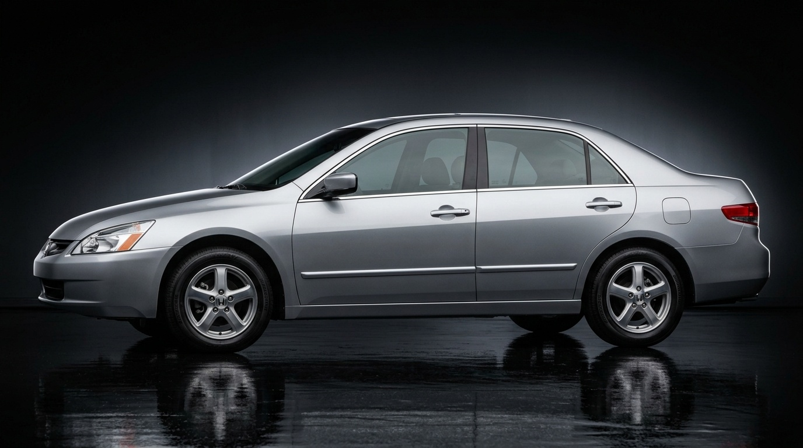
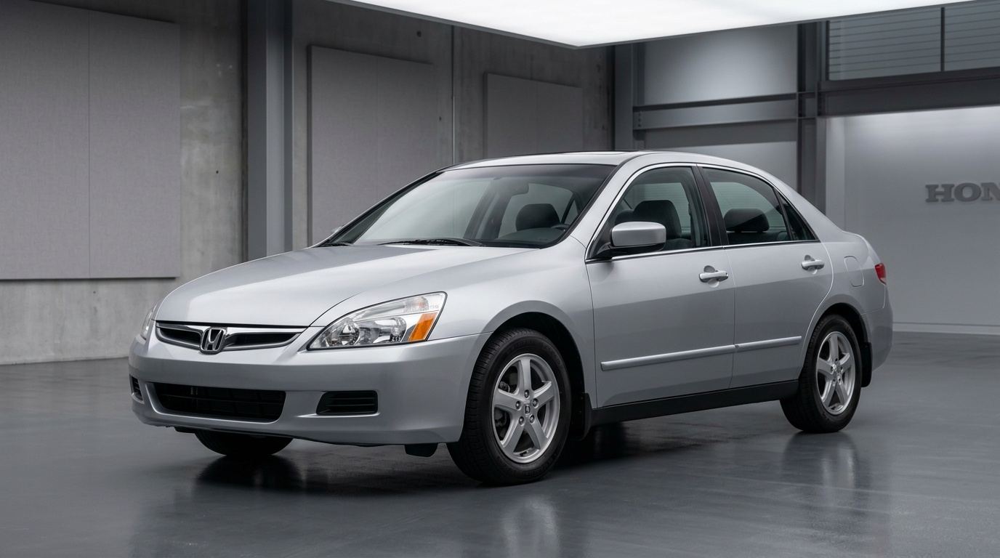
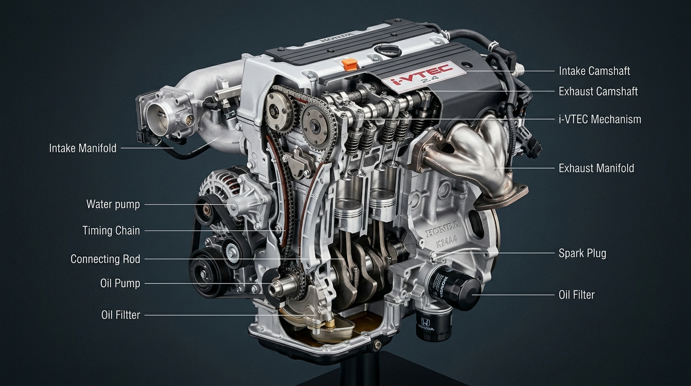
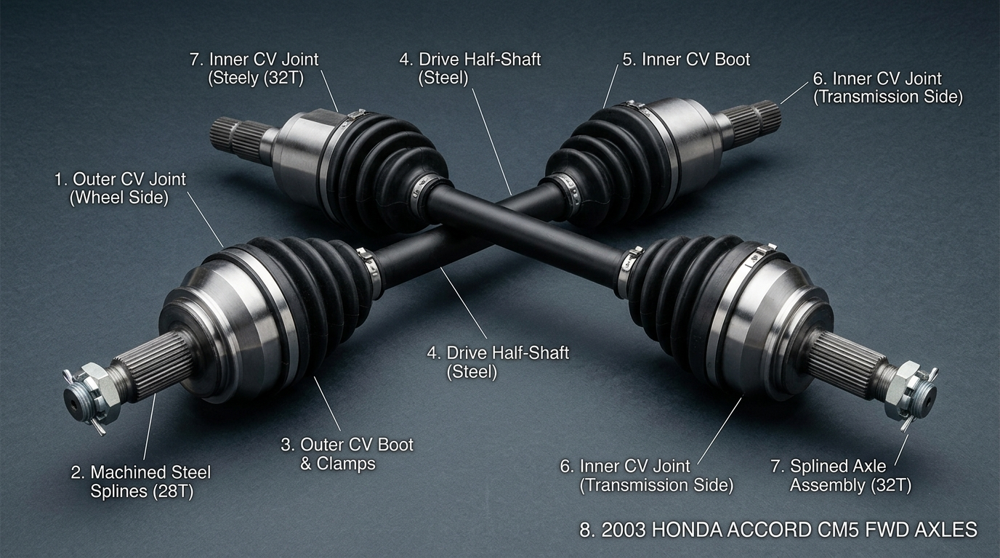
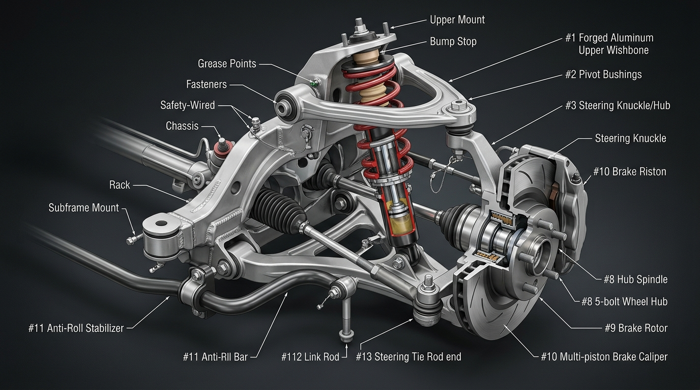
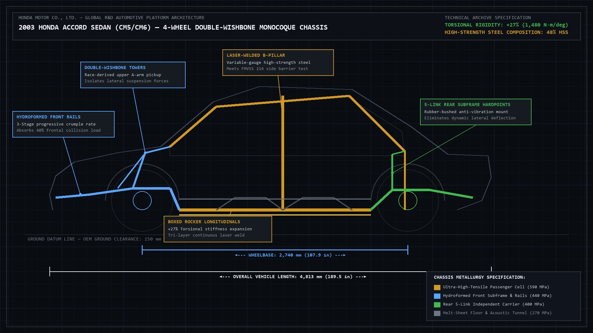
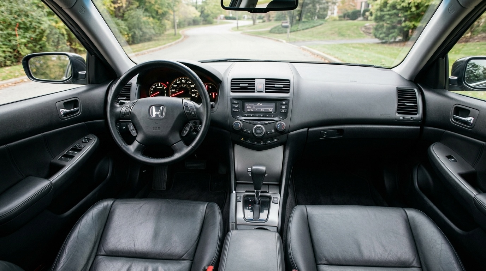
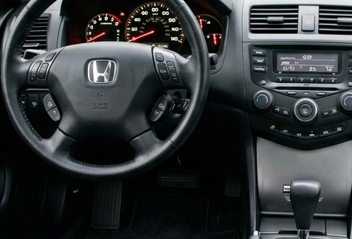
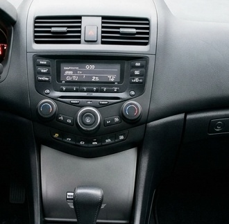
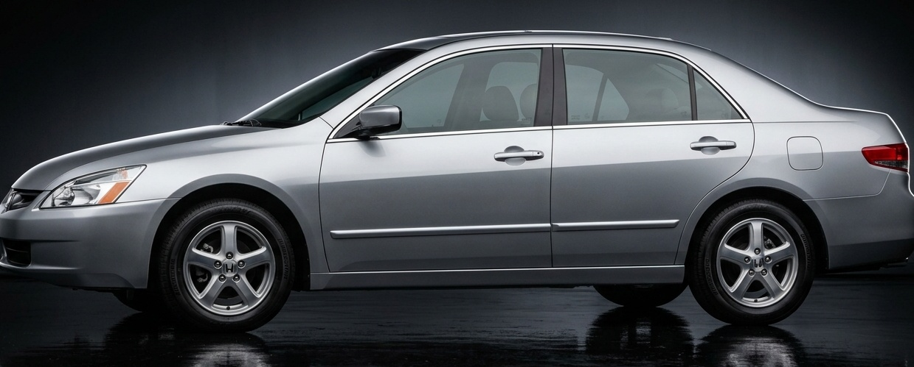

<div align="center">

# 🚗 2003 Honda Accord — My Machine. My Archive. My Story.

### *This isn't just a website. This is a tribute to the car I own.*

<br/>

> *"Every visible line begins with a functional requirement."*  
> — Honda Engineering Philosophy, Sayama R&D Division

<br/>


[](https://github.com/Likethan/Honda-Concept)

<br/>



*FIG 0.1 — 2003 Honda Accord Sedan (Chassis CM5) in Satin Silver Metallic — Low-Cowl Wedge Silhouette & 0.30 Cd Drag Profile*

</div>

---

## 🔥 Why This Exists

This repository is not just a portfolio project or a web application demo.

**This is the car I own.** The 2003 Honda Accord — 7th Generation, Chassis CM5 — sits in my garage. I've driven it through rain and heat, felt the VTEC kick in on open roads, and listened to the exhaust note that engineers at Sayama perfected for years before it ever left the factory floor.

When I decided to build something to honour it, I didn't want a generic landing page. I wanted something that captured the engineering precision, the obsession with detail, and the deep respect I have for what Honda built in 2003.

**So I built an interactive engineering archive.** Something worthy of the machine.

---

## 🏆 The Car — 2003 Honda Accord (7th Generation)

```
CHASSIS CODE     : CM5 (2.4L DOHC i-VTEC) / CM6 (3.0L SOHC VTEC V6)
MODEL YEAR       : 2003 — 2007
PLATFORM         : 4-Wheel Double-Wishbone Race-Derived Suspension
WHEELBASE        : 2,740 mm  (107.9 in)
OVERALL LENGTH   : 4,813 mm  (189.5 in)
DRAG COEFFICIENT : 0.30 Cd   (class-leading aerodynamic profile)
ASSEMBLY PLANT   : Marysville Auto Plant, Ohio / Sayama R&D, Japan
```

<div align="center">
  
  <br/>
  <em><strong>FIG 1.1</strong> — Authentic OEM Studio Archival Photo — 7th Gen Accord CM5/CM6 Front 3/4 Wedge Stance</em>
</div>

<br/>

The 7th Generation Accord is, in many automotive circles, considered the **peak of Honda's engineering purity** — before electrification changed everything. The fully independent 4-wheel double-wishbone suspension was a direct inheritance from Honda's Formula 1 philosophy. The K24A4 i-VTEC engine was among the most refined naturally-aspirated units Honda ever produced.

To own one is to own a piece of engineering history.

---

## ⚙️ Powertrain — K24A4 i-VTEC: A Mechanical Marvel

The heart of the CM5 is the `K24A4` — a 2.4L DOHC 16-valve i-VTEC engine with Variable Timing Control (VTC) on the intake cam. This interactive archive documents all three operating regimes:

| Regime | RPM Range | Mechanism | Lift | Purpose |
|---|---|---|---|---|
| 01 — Low-RPM Swirl | < 2,500 RPM | Single intake valve, helical port vortex | 3.0 mm | Ultra-lean combustion, low emissions |
| 02 — Mid-RPM VTC Advance | 2,500 – 5,500 RPM | Continuous hydraulic cam-phasing up to 50° | 8.0 mm | Peak efficiency and torque |
| 03 — High-RPM VTEC Lockup | > 5,500 RPM | 60 PSI oil pressure to synchronizer pin | 10.5 mm | Maximum power extraction, VTEC scream |

<br/>

<div align="center">
  
  <br/>
  <em><strong>FIG 2.1</strong> — K24A4 2.4L DOHC 16-Valve i-VTEC Engine Architecture — Valvetrain, Camshafts, VTC Actuator, Timing Chain & Lubrication Paths</em>
</div>

<br/>

This is what VTEC means at a mechanical level. Not a meme — an engineering solution.

---

## ⚡ Drivetrain & Driveshafts — Equal-Length Half-Shafts & CV Axles

The front-wheel-drive architecture of the CM5 utilizes an intermediate half-shaft layout with equal-length driveshafts to virtually eliminate torque steer under full-throttle VTEC acceleration:

- **Splined Axle Half-Shafts**: Forged high-tensile alloy steel with 28-tooth wheel-side and 32-tooth transmission-side splines
- **Constant Velocity (CV) Joints**: High-articulation Rzeppa outer joints and tripod inner plunging joints designed for silent torque transfer
- **Tuned Dampers & Heavy-Duty Boots**: Chloroprene boots with stainless-steel tension bands engineered to endure 150,000+ miles of high-speed rotation

<br/>

<div align="center">
  
  <br/>
  <em><strong>FIG 2.2</strong> — 2003 Honda Accord CM5 Front-Wheel-Drive Driveshaft, Inner & Outer CV Joints, and Splined Axle Assembly</em>
</div>

---

## 🔩 Suspension & Braking System — Race-Derived Kinematics

Unlike competitors that switched to cheaper front MacPherson struts, the 2003 Accord retains pure race-derived double-wishbone geometry:

- **Front Double-Wishbone Geometry**: Forged aluminum upper A-arm, high-rigidity lower control arm, and coilover damper assembly with anti-dive geometry
- **Negative Camber Compensation**: Keeps the tire contact patch flat and perpendicular to the asphalt during aggressive high-G cornering
- **4-Wheel Disc Brakes**: Large ventilated front disc rotors paired with multi-piston calipers, Electronic Brake-force Distribution (EBD), and 4-channel ABS

<br/>

<div align="center">
  
  <br/>
  <em><strong>FIG 3.1</strong> — Front Double-Wishbone Suspension System: Forged Aluminum Upper Wishbone, Coilover Damper, Steering Knuckle, Subframe Mount & Ventilated Disc Brakes</em>
</div>

---

## 🏗️ High-Tensile Monocoque Chassis Architecture

Achieving a **+27% increase in torsional stiffness** and a **+13% gain in bending resistance** over the 6th Generation platform:

- **Hydroformed Front Frame Rails**: 3-stage progressive crush sequencing absorbing 40% of frontal collision energy
- **Laser-Welded Tailored Blank B-Pillar**: Variable-thickness high-strength steel (590 MPa) forming a rigid roll cage around occupants
- **Boxed Rocker Longitudinal Sills**: Tri-layer continuous laser-welded floor rails preventing structural deflection
- **Isolated Rear Multi-Link Subframe**: 5-link independent rear suspension mounting points with fluid-filled compliance bushings

<br/>

<div align="center">
  
  <br/>
  <em><strong>FIG 3.2</strong> — High-Tensile Monocoque Chassis Architecture Blueprint: Hydroformed Front Crush Rails, Laser-Welded B-Pillars, Boxed Rockers & Rear Subframe (+27% Torsional Rigidity)</em>
</div>

---

## 🎯 What This Archive Documents

This isn't a static brochure. It's an **interactive technical dossier** — purpose-built to capture the depth of what Honda engineered:

### 1. 🔩 Suspension & Chassis Kinematics
- Race-derived 4-wheel double-wishbone geometry with negative camber compensation under compression
- +27% torsional stiffness improvement over the 6th Generation through boxed rocker reinforcements and laser-welded tailored blanks
- High-tensile unibody monocoque with Marysville-calibrated front frame rail crumple sequencing

### 2. 💨 Aerodynamics & Body Design
- 0.30 Cd drag coefficient achieved through underbody diffuser channelling, lowered cowl datum, and flush window sealing
- Flush-mount side glass with zero-gap A-pillar transition to reduce wind separation
- Sharp trailing-edge decklid geometry to prevent low-speed turbulent wake

### 3. 🧠 Interactive i-VTEC + VTC Schematic
- Live simulation of hydraulic rocker-pin engagement, oil gallery pressure paths, and camshaft lobe transitions
- Visual cam phase advance from 0° to 50° on demand
- Regime switching animation with technical callout overlays

### 4. 🪑 Driver Cockpit & NVH Engineering
- Panoramic forward sightlines: -25 mm lowered cowl, 73 mm ultra-slim A-pillar profile
- Hydraulic liquid-filled engine mounts that absorb vibration through fluid inertia
- 3-layer acoustic sandwich floor construction: melt-sheet bitumen → acoustic felt → carpet

<br/>

<div align="center">
  
  <br/>
  <em><strong>FIG 4.1</strong> — Driver-Centric Cockpit: -25 mm Lowered Cowl Sightline, Dual-Zone Climate & Ergonomic Switchgear</em>
</div>

<br/>

### 5. 📊 Factory Specification Matrix
- Side-by-side engineering comparison: **EX 2.4L i-VTEC (CM5)** vs. **EX-V6 3.0L VTEC (CM6)**
- 25+ certified parameters across powertrain, chassis, dimensions, acoustics, and electronics
- Drag coefficient, brake bias, valvetrain stroke, compression ratio, and more

### 6. 📜 Generation Evolution Timeline
- Complete 11-generation Honda Accord chronology from 1976 through the present
- Era-filtered navigation: All Generations, Classic (1976–1997), Modern (1998–Present)
- Generation 07 (2003–2007) highlighted as the active archive specification

---

## 🔍 Macro Technical Inspection Gallery

Certified OEM engineering close-ups documenting the physical materiality of the 2003 Accord:

| Electroluminescent LED Cockpit | Aerodynamic Ducktail & Lighting |
|:---:|:---:|
| <br/>*Three-stage LED progressive cluster* | <br/>*Integrated ducktail decklid & crystalline lenses* |
| **Tactile Dual-Zone Center Stack** | **Double-Wishbone Wedge Stance** |
| <br/>*Knurled rotary detents & in-dash 6-CD stack* | <br/>*1,555 mm wide track & low-cowl forward rake* |

---

## 🛠️ Technical Build

This project is built to the same standard of precision that Honda brought to the CM5.

```
Framework    : Next.js 14 (App Router) + TypeScript
Styling      : Vanilla CSS — no frameworks, full control
Typography   : Space Grotesk (editorial) + JetBrains Mono (engineering data)
Architecture : Component-driven, SEO-optimised, statically pre-rendered
Performance  : 17.9 kB page route | 87.3 kB shared JS runtime | Zero build errors
Aesthetic    : Honda OEM Technical Archive / SAE Engineering Publication
```

---

## 🗂️ Repository Structure

```
Honda-Concept/
├── app/
│   ├── globals.css              # Engineering design system — typography, tokens, layout
│   ├── layout.tsx               # Root layout with SEO, metadata, and Open Graph
│   └── page.tsx                 # Main showcase page assembly
│
├── components/
│   ├── Header.tsx               # Sticky section navigation + document index
│   ├── Hero.tsx                 # Chassis telemetry, dimensional callouts, profile image
│   ├── EditorialIntro.tsx       # Engineering thesis and Honda philosophy
│   ├── EngineeringSection.tsx   # Interactive mechanical viewer (exterior, engine, axle, suspension, chassis)
│   ├── PowertrainDiagram.tsx    # Interactive i-VTEC 3-regime valvetrain simulation
│   ├── CabinSection.tsx         # Cockpit geometry, sightlines, NVH accordion
│   ├── DetailGallery.tsx        # Macro inspection grid and technical modal
│   ├── SpecMatrix.tsx           # EX 2.4L vs. EX-V6 3.0L factory specification table
│   ├── EvolutionTimeline.tsx    # 11-generation Honda Accord chronology
│   └── Footer.tsx               # Assembly provenance and OEM document references
│
├── data/
│   └── accord.ts                # All technical data, specifications, and editorial copy
│
└── public/
    └── images/
        ├── hero/                # Hero unibody profile photography (accord-profile.jpg)
        ├── engineering/         # Exterior studio & dynamic imagery (accord-exterior.jpg)
        ├── mechanical/          # K24A4 engine, driveshaft, double-wishbone suspension, chassis blueprint
        ├── interior/            # Driver cockpit & panoramic sightlines (accord-cabin.jpg)
        └── details/             # Macro inspection photography (cockpit, console, rear, stance)
```

---

## 🚀 Run It Locally

```bash
# Clone
git clone https://github.com/Likethan/Honda-Concept.git
cd Honda-Concept

# Install dependencies
npm install

# Launch dev server
npm run dev
```

Open **[http://localhost:3000](http://localhost:3000)**

```bash
# Production build
npm run build
npm run start
```

---

## 📐 Design Philosophy

The visual language of this archive deliberately avoids the generic aesthetics of modern portfolio sites.

- **No glassmorphism** — Honda's engineering is honest. So is this UI.
- **No purple gradients** — The colour palette is pulled directly from Honda's OEM documentation: charcoal, oxide red, and precision white.
- **Monospaced data** — Every technical metric is rendered in JetBrains Mono, the same way it would appear in a factory calibration sheet.
- **Dotted leaders** — The dimensional callout lines and measurement annotations echo Honda's SAE-standard engineering drawings.

This is what respect for a machine looks like in code.

---

## 🙏 A Note From the Owner

The 2003 Honda Accord is a car that asks nothing dramatic of you and delivers everything quietly. It doesn't shout. It doesn't need to. The geometry is right. The engine responds with honesty. The cabin is calm in a way that takes years of NVH engineering to achieve.

I built this archive because I believe the engineering deserves to be seen. Not just driven.

Every section of this website is a documentation of something I personally experience behind the wheel — the VTEC engagement at 5,500 RPM, the driver's sightline over the low-cowl hood, the planted feel through double-wishbone corners.

**This car is mine. This archive is my tribute to it.**

---

<div align="center">

**Built by [Likethan K J](https://github.com/Likethan) — Owner of a 2003 Honda Accord CM5**

*"Man Maximum, Machine Minimum. Honda has always understood that the car exists for the driver — not the other way around."*

[](https://github.com/Likethan)

</div>
